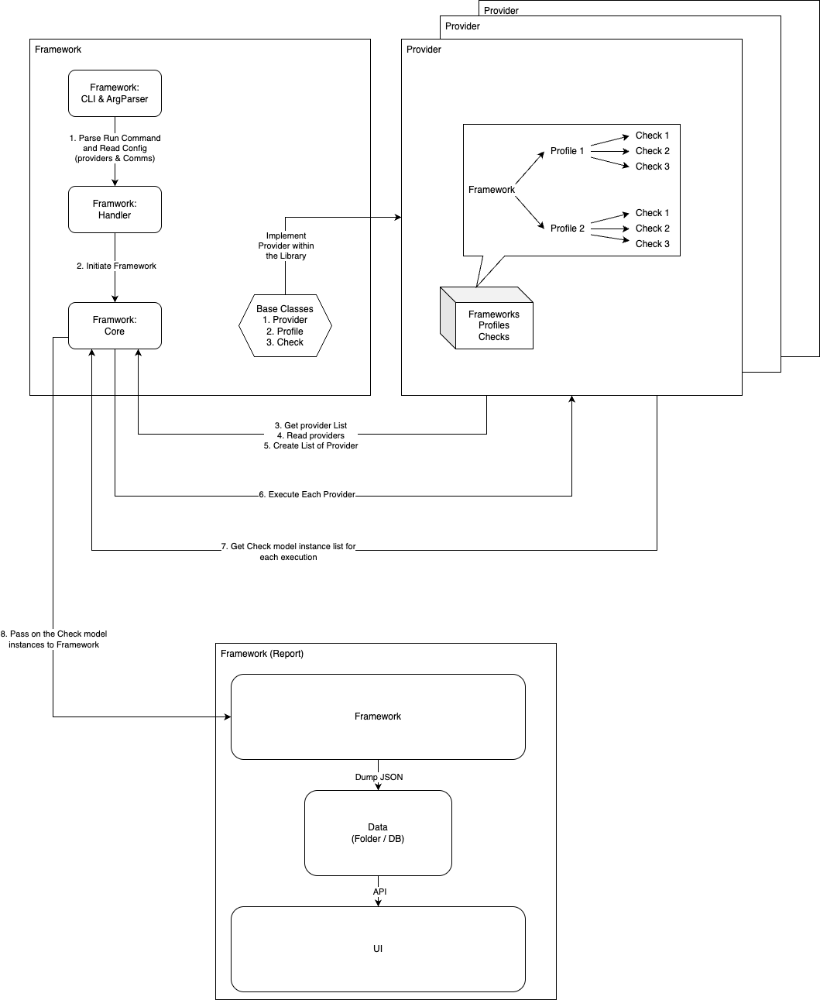

# Overview

Before even starting as a Developer of the Tevico Community project, you should start understanding the basics of its vision and the workflow. This will give you a deeper understanding of the project and align your code logic with the expected outcome.

## Project Vision

The vision of the project can be broken down into a simple statement - 

> <mark>***"Leverage Tevico to gain actionable insights in a secure way and enhance infrastructure efficiency."***</mark>

Let us try to break down this vision in 3 parts -

1. **Actionable Insights** - Deep set of insights into the infrastructure of its user
2. **Secure Way** - Collect these insights in a secure way
3. **Infrastructure Efficiency** - Guide its user to improve the efficiency of its infrastructure

Once this philosophy is clear you can proceed with understanding its workflow.

## Project Workflow

The project workflow provides a **birds-eye view** on the question of **"How Tevico Community works?"**. 

### 1. The `main` Command

The main command is the entry point of this project. Before even initiating the framework, the main command parses the CLI params, accordingly initiates the [`TevicoConfig`](https://github.com/comprinnotech/tevico-community/blob/8af9e0596f1b010712c657d12cacdf86888bbdf3/tevico/engine/configs/config.py#L34) object and runs the required set of functions to either `run` the project or `create` entities. As the arguments are parsed the config is passed to the Framework Handler.

### 2. Framework Handler

Think of the [`FrameworkHandler`](https://github.com/comprinnotech/tevico-community/blob/main/tevico/engine/handler.py) as a wrapper around the framework itself. It encapsulates and abstracts the configuration from the [`TevicoFramework`](https://github.com/comprinnotech/tevico-community/blob/8af9e0596f1b010712c657d12cacdf86888bbdf3/tevico/engine/framework.py#L19) and depending on the command given in the CLI param it executes the framework.

### 3. Framework

The [`Framework`](https://github.com/comprinnotech/tevico-community/blob/8af9e0596f1b010712c657d12cacdf86888bbdf3/tevico/engine/framework.py#L262) executes the following sequence of actions for the `run` command -

1. Load the [providers](../entities/provider.md)
2. For every [provider](../entities/provider.md), establish connection
3. Start execution
4. Collect all [check](../entities/check.md) responses
5. Generate report

### 4. Report

The report will be generated in a `.zip` format in the AWS CloudShell. You can follow the steps given in the [Get Started -> Download report](../../index.md#download-report) section of this documentation to download the report.

Once you have extracted the report you can explore the report in 3 ways -

1. Overview - An aggregated or a bird's eye view of the infra
2. Browse - Browse by filtering through the [checks](../entities/check.md)
3. Well-Architected Review - An overall understanding of WAR in your infra

The diagram given below shows the workflow for the `run` command.

