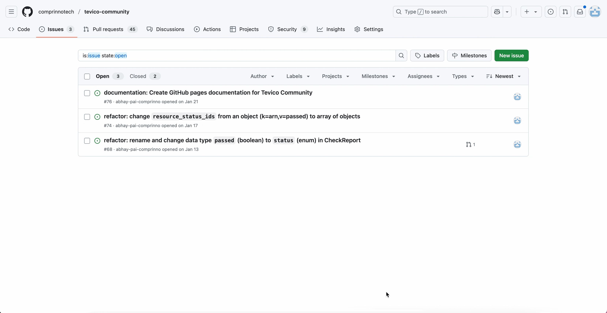

## 1. Raising a Ticket (Issue)

1. **Identify a Problem or Feature**
    - Detect a bug, improvement, or new feature idea for Tevico Community.
    - Search the [Tevico Issues](https://github.com/comprinnotech/tevico-community/issues) to avoid duplicates.
2. **Create an Issue**
    - Go to the Tevico’s Issues tab.
    - Click **"New Issue"**.
    - Select the appropriate template (bug, feature, etc.).
    - Fill in required details:
        - **Title**: Concise description.
        - **Description**: Detailed information, steps to reproduce (if bug), screenshots, etc.
    - Submit the issue.

3. **Issue Triage**
    - Project maintainers review the issue.
    - The issue may be labeled, assigned, or discussed further.



---

## 2. Forking and Cloning the Repository

1. **Fork the Repository**
    - Click the **"Fork"** button at the top right of the repo page.  
    - This creates a copy under your GitHub account.

2. **Clone Your Fork**
    - Copy your fork’s URL.
    - In your terminal:
        ```bash
        git clone https://github.com/<YOUR_GITHUB_USERNAME>/tevico-community.git
        ```
    - Navigate into the cloned directory:
        ```bash
        cd tevico-community
        ```

---

## 3. Creating a Branch

1. **Sync with Upstream**
    - Add tevico as an upstream remote:
        ```bash
        git remote add upstream https://github.com/comprinnotech/tevico-community.git
        ```
    - Fetch latest changes:
        ```bash
        git fetch upstream
        git checkout main
        git merge upstream/main
        ```

2. **Create a Feature/Issue Branch**
    - Name your branch descriptively, e.g., `fix/issue-123-bug-description` or `feature/new-login-ui`:
        ```bash
        git checkout -b fix/issue-123-bug-description
        ```
    - OR you can create a Branch Directly from GitHub
        - Navigate to the issue page on the GitHub repository.
        - Click the "Create a branch" link in the right sidebar.
        - Choose your fork as the repository (if prompted).
        - Accept or modify the suggested branch name.
        - Click "Create branch" to generate the branch.
        - Pull the new branch to your local repository:
            ```bash
            git fetch origin
            git checkout branch-name
            ```

---

## 4. Development

1. **Make Code Changes**
    - Implement your fix or feature.
    - Regularly commit your work with clear messages:
        ```bash
        git add .
        git commit -m "Fix: Issue #123, resolve login bug"
        ```
    - Follow commit message best practices:
        ```
        <type>: <subject>
        
        [optional body]
        ```
        Where `type` is one of: feat, fix, docs, style, refactor, test, chore

    !!! note "Linking Issues in Commits"
        
        Use hashtags to reference issues in your commit messages:
        ```shell
        git commit -m "fix: resolve login redirect bug #123"
        ```
        This creates a reference to issue #123 in your commit history.

2. **Test Your Changes**
    - Run existing and new tests to ensure code quality.

3. **Keep Your Branch Updated**
    - Periodically pull from the upstream main branch:
        ```bash
        git fetch upstream
        git merge upstream/main
        ```
    - Resolve any merge conflicts.

---

## 5. Push and Create Pull Request

1. **Push Your Branch**
    - Push your changes to your fork:
        ```bash
        git push origin fix/issue-123-bug-description
        ```

2. **Create a Pull Request (PR)**
    - Go to the original repository on GitHub.
    - Click **"Compare & pull request"**.
    - Fill out the PR form:
        - **Link the Issue**: Use `Closes #123` to auto-close the issue on merge.
        - **Describe Your Changes**: Summarize what and why.
    - Submit the PR.

---

## 6. Code Review & Iteration

1. **Engage in Review**
    - Respond to feedback from maintainers and reviewers.
    - Make additional commits as needed.

<!-- 2. **CI/CD Checks**
    - Ensure all automated checks (tests, lints, etc.) pass. -->

---

## 7. Merging

1. **Approval**
    - Wait for reviews and approvals as per project policy.

2. **Merge**
    - Maintainers (or you, if permitted) merge the PR.
    - The issue is closed automatically if linked.

3. **Cleanup**
    - Delete your feature branch remotely and locally:
        ```bash
        git push origin --delete fix/issue-123-bug-description
        git branch -d fix/issue-123-bug-description
        ```

---