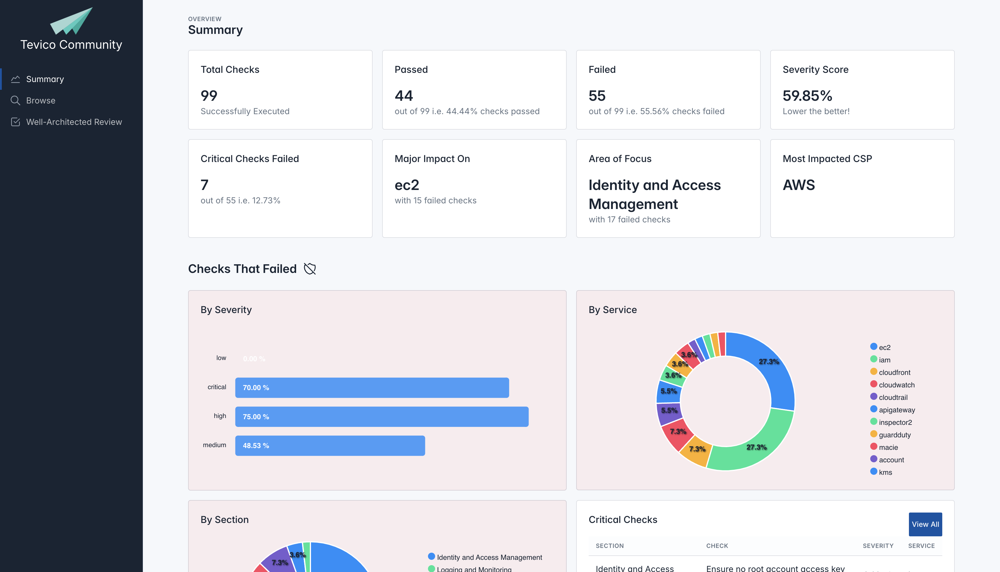

# Welcome to Tevico Community!

Tevico is an extensible open-source, Python-based auditing framework that empowers users and developers to comprehensively check their infrastructure and apps for compliance adherence, security vulnerabilities, and custom operational checks.

## Get started

To run the project simply execute the following code in your Cloudshell

```shell
curl https://raw.githubusercontent.com/comprinnotech/tevico-community/refs/heads/main/run.sh?ts=$(date +%s) | bash
```


For more examples, options and manual execution please check the [Project Setup](project-setup.md) and [CLI Params](cli-params.md) under `Manually Generate Report`.

!!! note "Run a specific branch"

    The following command helps with running a specific branch. The example given below executes `dev` branch.
    ```shell
    curl https://raw.githubusercontent.com/comprinnotech/tevico-community/refs/heads/main/run.sh?ts=$(date +%s) | bash -s dev
    ```

## Download Report

Downloading the report from AWS Cloudshell is super easy.


Simply follow the 4 steps given below.

1. Copy the Report's ZIP Path
2. Click on Actions > Download File
3. Enter the path to the ZIP file > Download
4. Extract the ZIP file and open `index.html`

You'll see a simple, concise and presentable report as shown below.



## Why use Tevico Community?

* **One Command Execution** - Execute the project with a single command, eliminating the need for heavy setup, deployment, or additional resources. This simplicity allows you to quickly start auditing your infrastructure and applications.
* **Extensible** - Easily extend Tevico Community by adding new Providers, Checks, Profiles, and Frameworks. This flexibility ensures that the tool can grow and adapt to your specific needs.
* **Offline Support** - The generated report can be accessed offline, ensuring that you can review your audit results without needing an internet connection.
* **Simple, Concise & Presentable Report** - The report is packaged in a `zip` file, which can be extracted to access a clear, concise, and well-organized document, making it easy to interpret and share.
* **Comprehensive Checks** - A broad and continuously expanding set of checks helps you maintain a streamlined and secure infrastructure.
* **Open Source** - Every aspect of this project is open source. There are numerous ways to contribute!
* **Developer Friendly** - Developers can utilize the developer-friendly CLI commands to create various entities, simplifying the development process and boosting productivity.


## Shoutout

Being part of Open Source Community, we would like to give a shoutout to different projects on which this Framework is built on. If you're interested in learning more about them then please check them out.

* **[Pydantic](https://docs.pydantic.dev/latest/)** - A data validation and settings management library for Python, leveraging Python type annotations. It ensures data integrity by validating input data against defined schemas.
* **[Poetry](https://python-poetry.org/)** - A dependency management and packaging tool for Python. It simplifies the process of managing project dependencies and packaging projects for distribution.
* **[Tabler](https://tabler.io/admin-template)** - A modern and responsive open-source dashboard template built with Bootstrap. It provides a clean and customizable interface for web applications.
* **[Jinja](https://jinja.palletsprojects.com/en/stable/)** - A fast, expressive, and extensible templating engine for Python. It is commonly used to generate HTML dynamically in web applications.
* **[Boto3](https://boto3.amazonaws.com/v1/documentation/api/latest/index.html)** - The Amazon Web Services (AWS) SDK for Python. It allows developers to interact with AWS services like S3, EC2, and DynamoDB using Python code.
* **[MKDocs Material](https://squidfunk.github.io/mkdocs-material/)** - A theme for the static site generator MKDocs, designed for project documentation. It offers a clean, responsive design and numerous customization options.

## Contributers

* **[Abhay N. Pai](https://github.com/abhaynpai)** - A Software Engineer by heart and an Entrepreneur by profession. You can read more about him [here](https://abhaypai.com).
* **[Bhupali Tambekar](https://www.linkedin.com/in/bhupali-tambekar-627343a3/)** - Bhupali is a skilled software engineer with extensive experience in managing scalable infrastructure. She has a strong background in cloud technologies and her versatile management skills make her the perfect CTO at Comprinno.
* **[Niraj Ranjan]()** -
* **[Suhaib Wani]()** -
* **[Deepak Puri]()** -
* **[Aafaq Rashid]()** -